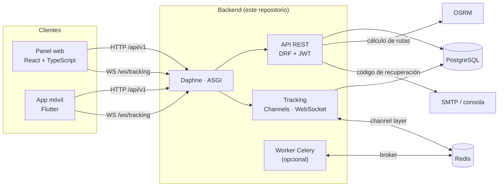
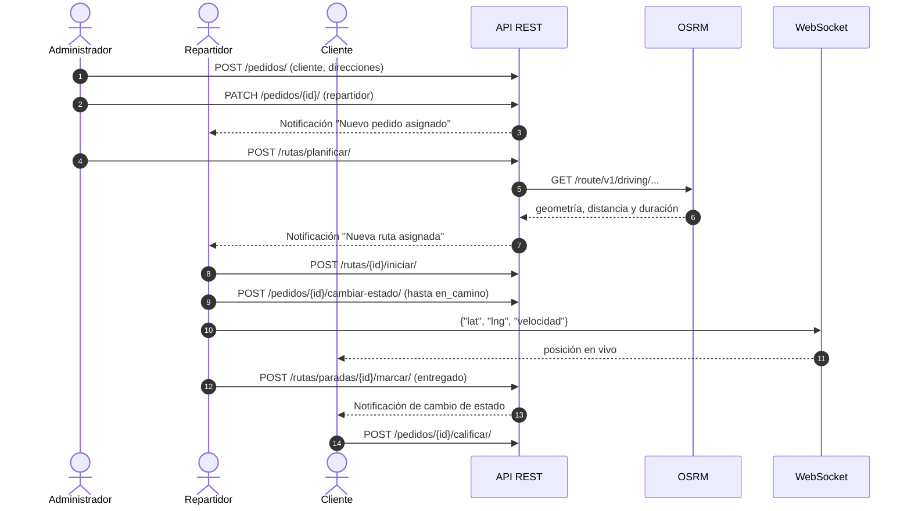
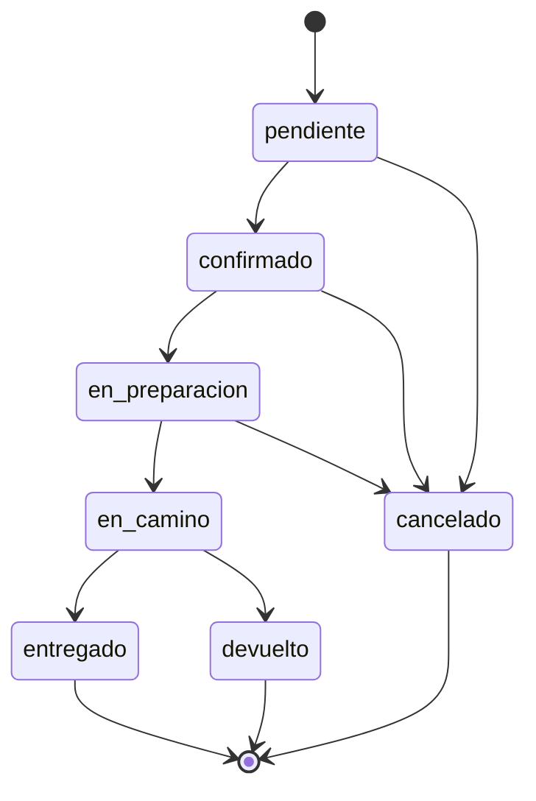
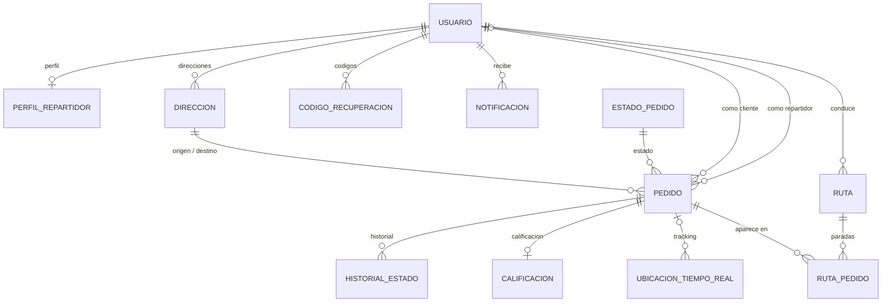

# Sistema de Logística y Envíos — Backend

API REST y servidor de tiempo real para gestionar pedidos de envío, asignarlos a repartidores, planificar rutas y seguir cada entrega en vivo.


---

## Tabla de contenidos

- [Qué resuelve](#qué-resuelve)
- [Características](#características)
- [Stack tecnológico](#stack-tecnológico)
- [Arquitectura](#arquitectura)
- [Flujo de funcionamiento](#flujo-de-funcionamiento)
- [Requisitos previos](#requisitos-previos)
- [Instalación local](#instalación-local)
- [Variables de entorno](#variables-de-entorno)
- [Ejecución](#ejecución)
- [API](#api)
- [Tracking en tiempo real (WebSocket)](#tracking-en-tiempo-real-websocket)
- [Modelo de datos](#modelo-de-datos)
- [Pruebas](#pruebas)
- [Estructura del proyecto](#estructura-del-proyecto)
- [Decisiones de diseño](#decisiones-de-diseño)
- [Limitaciones conocidas](#limitaciones-conocidas)

---

## Qué resuelve

Una operación de reparto necesita responder tres preguntas: **qué pedido está en qué estado**, **quién lo lleva por dónde** y **dónde está ahora**. Este backend centraliza esa información para tres perfiles de usuario:

| Rol | Qué hace en el sistema |
|---|---|
| **Cliente** | Crea sus pedidos, sigue su estado y su posición, cancela y califica al repartidor |
| **Repartidor** | Ve sus pedidos y rutas, avanza estados, cierra paradas y emite su ubicación |
| **Administrador** | Gestiona usuarios, asigna repartidores, planifica rutas y consulta reportes |

### Componentes del sistema completo

Este repositorio documenta **solo el backend**. Los clientes que lo consumen viven en carpetas hermanas:

| Carpeta | Stack | Rol |
|---|---|---|
| `backend_logistica` | Django REST Framework + Channels + Celery | API REST, WebSockets y PostgreSQL *(este repositorio)* |
| `frontend_logistica` | React 18 + TypeScript + Vite + Leaflet | Panel web del administrador |
| `movil_logistica` | Flutter (`flutter_map`, `geolocator`, `web_socket_channel`) | App de cliente y repartidor |

<!-- PENDIENTE: enlazar los repositorios del panel web y de la app móvil cuando estén publicados. -->

---

## Características

- **Autenticación JWT** (login y refresh con rotación de tokens) y tres roles con permisos y datos acotados por rol.
- **Pedidos con máquina de estados**: transiciones validadas en servidor, código de seguimiento único (`LOG-XXXXXXXX`) e historial de cada cambio.
- **Planificación de rutas**: el backend consulta **OSRM**, guarda la geometría (polyline), la distancia y el tiempo estimado, y expone el orden de paradas.
- **Cierre de paradas** (`entregado` / `fallido`) sincronizado con el estado del pedido dentro de una transacción.
- **Tracking en tiempo real** por WebSocket (Django Channels), con permisos distintos para *ver* y para *emitir*, e histórico persistido.
- **Calificaciones** de 1 a 5, una por pedido, que actualizan el promedio del repartidor.
- **Notificaciones** persistidas por usuario (asignación de pedido, cambio de estado, ruta asignada/actualizada).
- **Recuperación de contraseña** con código de 6 dígitos por correo: almacenado con HMAC, con caducidad e intentos limitados.
- **Reportes** de rendimiento de repartidores sobre una **VIEW SQL** de PostgreSQL, más KPIs de resumen.
- **Limitación de tasa** (throttling) en registro y recuperación de contraseña.
- **Documentación OpenAPI/Swagger** generada con drf-spectacular.
- **Panel Django Admin** (`/admin/`) para usuarios, pedidos, rutas y estados.
- Filtros, búsqueda, ordenación y paginación (`page`, `page_size`, máximo 100) en los listados estándar.
- **Docker Compose** con PostgreSQL, Redis, backend y worker de Celery.

---

## Stack tecnológico

| Capa | Tecnología | Versión |
|---|---|---|
| Lenguaje | Python | 3.10+ (la imagen Docker usa 3.12) |
| Framework web | Django | 5.0.6 |
| API REST | Django REST Framework | 3.15.1 |
| Autenticación | djangorestframework-simplejwt | 5.3.1 |
| Tiempo real | Channels · channels-redis · Daphne (ASGI) | 4.1.0 · 4.2.0 · 4.1.2 |
| Tareas asíncronas | Celery + Redis | 5.4.0 · redis-py 5.0.4 |
| Base de datos | PostgreSQL (`psycopg2-binary` 2.9.9) | 16 en `docker-compose.yml` |
| Documentación API | drf-spectacular | 0.27.2 |
| Filtros y CORS | django-filter · django-cors-headers | 24.2 · 4.3.1 |
| Configuración | python-decouple | 3.8 |
| Cliente HTTP (OSRM) | requests | 2.32.3 |
| Pruebas | pytest · pytest-django · factory-boy | 8.2.1 · 4.8.0 · 3.3.0 |
| Producción (`requirements/prod.txt`) | gunicorn · whitenoise | 22.0.0 · 6.6.0 |
| Servicio externo | OSRM (servidor público por defecto) | — |

---

## Arquitectura



- Un único proceso **ASGI** (`config.asgi:application`) atiende HTTP y WebSocket. El WebSocket se autentica con JWT (`core/ws_auth.py`), no con cookies de sesión.
- **Es el backend quien llama a OSRM**, no el cliente: web y móvil dibujan la misma geometría guardada en base de datos.
- En **desarrollo** el *channel layer* es en memoria (un solo proceso Daphne), así que Redis no es obligatorio. En producción `base.py` apunta a `channels_redis`.
- **Celery es opcional** y está desactivado por defecto (`CELERY_ENABLED=False`).

### Apps de dominio

| App | Responsabilidad |
|---|---|
| `usuarios` | Modelo `Usuario` (login por email, campo `rol`), perfil de repartidor, direcciones, registro, recuperación de contraseña, `seed_demo` |
| `pedidos` | Pedido, estados, historial, calificaciones, máquina de estados, señales de notificación |
| `rutas` | Rutas, paradas, cliente OSRM (`services/osrm_client.py`) |
| `tracking` | Consumer WebSocket y ubicaciones en tiempo real |
| `reportes` | VIEW SQL de rendimiento y KPIs |
| `notificaciones` | Notificaciones por usuario y tarea Celery de envío |

---

## Flujo de funcionamiento



### Estados del pedido

Las transiciones válidas están definidas en `apps/pedidos/services.py`; cualquier otra devuelve `400`.



---

## Requisitos previos

| Requisito | Detalle |
|---|---|
| Python | 3.10 o superior |
| PostgreSQL | Servidor en marcha y una base de datos `logistica` creada (Django no la crea) |
| Redis | **Opcional** en desarrollo. Necesario para Celery o para probar el *channel layer* real |
| Docker y Docker Compose | Opcional, solo para la ruta con contenedores |
| Acceso a internet | Para calcular rutas con el OSRM público (configurable con `OSRM_URL`) |

---

## Instalación local

**1. Clonar el repositorio**

```bash
git clone <URL-DEL-REPOSITORIO>
cd backend_logistica
```

**2. Crear y activar el entorno virtual**

```powershell
# Windows (PowerShell)
python -m venv venv
venv\Scripts\Activate.ps1
```

```bash
# macOS / Linux
python -m venv venv
source venv/bin/activate
```

**3. Instalar dependencias**

```bash
pip install -r requirements/dev.txt
```

**4. Crear la base de datos**

```bash
psql -U postgres -c "CREATE DATABASE logistica;"
```

**5. Configurar las variables de entorno**

```powershell
# Windows (PowerShell)
Copy-Item .env.example .env
```

```bash
# macOS / Linux
cp .env.example .env
```

Edita `.env` (ver [Variables de entorno](#variables-de-entorno)). Como mínimo: `DB_PASSWORD` y `SECRET_KEY`.

> ⚠️ **Deja `EMAIL_HOST_USER` y `EMAIL_HOST_PASSWORD` vacíos** si no vas a enviar correo real. Si ambos tienen valor, el backend activa SMTP automáticamente; vacíos, los correos se imprimen en el terminal.

**6. Migrar y cargar datos de demostración**

```bash
python manage.py migrate
python manage.py seed_demo
```

La migración `pedidos/0003_seed_estados` carga los siete estados de pedido; `seed_demo` crea usuarios, direcciones y un pedido de ejemplo.

### Con Docker Compose

```bash
docker compose up --build
docker compose exec backend python manage.py seed_demo
```

Levanta cuatro servicios: `db` (postgres:16), `redis` (redis:7-alpine), `backend` (ejecuta `migrate` y Daphne en el puerto 8000) y `celery` (worker).

Antes de arrancar, ten en cuenta:

- `backend` y `celery` leen `.env` (`env_file`). Dentro de la red de Compose los servicios se llaman `db` y `redis`, por lo que en ese `.env` **`DB_HOST` debe ser `db`** y **`REDIS_URL` debe ser `redis://redis:6379/0`**. Los valores `localhost` de `.env.example` solo sirven para ejecución local.
- `DB_PASSWORD` debe coincidir con `POSTGRES_PASSWORD`, definido en `docker-compose.yml`. Cambia esa contraseña de desarrollo si expones el puerto 5432.
- El worker de Celery solo procesa tareas si `CELERY_ENABLED=True`.
- La imagen instala `requirements/base.txt` (sin dependencias de pruebas).

> ℹ️ La ruta con Docker no se ha ejecutado durante la redacción de esta documentación; se describe según `Dockerfile` y `docker-compose.yml`.

---

## Variables de entorno

Se leen con `python-decouple` desde `.env` (ver `.env.example`). **Nunca subas `.env` al repositorio** (ya figura en `.gitignore`).

| Variable | Por defecto | Descripción |
|---|---|---|
| `SECRET_KEY` | `insecure-dev-key` | Clave criptográfica de Django. **Obligatorio cambiarla fuera de desarrollo** |
| `DEBUG` | `False` | Modo depuración (`development.py` lo fuerza a `True`) |
| `ALLOWED_HOSTS` | `localhost,127.0.0.1` | Hosts permitidos, separados por comas (`development.py` acepta cualquiera) |
| `DB_NAME` | `logistica` | Nombre de la base de datos |
| `DB_USER` | `postgres` | Usuario de PostgreSQL |
| `DB_PASSWORD` | *(vacío)* | Contraseña de PostgreSQL |
| `DB_HOST` | `localhost` | Host de PostgreSQL |
| `DB_PORT` | `5432` | Puerto de PostgreSQL |
| `REDIS_URL` | `redis://localhost:6379/0` | Channel layer, broker y resultados de Celery, y caché en producción |
| `OSRM_URL` | `https://router.project-osrm.org` | Servidor OSRM para calcular rutas |
| `JWT_ACCESS_MINUTES` | `60` | Vida del token de acceso |
| `JWT_REFRESH_DAYS` | `7` | Vida del token de refresco |
| `EMAIL_HOST` | `smtp.gmail.com` | Servidor SMTP |
| `EMAIL_PORT` | `587` | Puerto SMTP |
| `EMAIL_USE_TLS` | `True` | TLS en SMTP |
| `EMAIL_HOST_USER` | *(vacío)* | Usuario SMTP. Vacío junto a la contraseña → correo por consola |
| `EMAIL_HOST_PASSWORD` | *(vacío)* | Con Gmail, una *contraseña de aplicación* (requiere verificación en dos pasos) |
| `DEFAULT_FROM_EMAIL` | `Logistica <no-reply@logistica.local>` | Remitente de los correos |
| `PASSWORD_RESET_CODIGO_MINUTOS` | `15` | Vigencia del código de recuperación |
| `PASSWORD_RESET_MAX_INTENTOS` | `5` | Intentos fallidos antes de invalidar el código |
| `CELERY_ENABLED` | `False` | Encola tareas en Celery (requiere Redis y un worker) |

`DJANGO_SETTINGS_MODULE` **no** se lee desde `.env`: `manage.py`, `asgi.py` y `celery.py` usan `config.settings.development` por defecto, y `pytest.ini` fija `config.settings.test`. Solo tiene efecto si se exporta como variable real del proceso (por ejemplo, vía `env_file` en Docker).

Ejemplo de `.env` mínimo para desarrollo local:

```dotenv
SECRET_KEY=<clave-larga-y-aleatoria>
DEBUG=True
ALLOWED_HOSTS=localhost,127.0.0.1

DB_NAME=logistica
DB_USER=postgres
DB_PASSWORD=<tu-contraseña-de-postgres>
DB_HOST=localhost
DB_PORT=5432

REDIS_URL=redis://localhost:6379/0
OSRM_URL=https://router.project-osrm.org

JWT_ACCESS_MINUTES=60
JWT_REFRESH_DAYS=7

# Vacíos: los correos se imprimen en el terminal del backend
EMAIL_HOST_USER=
EMAIL_HOST_PASSWORD=

CELERY_ENABLED=False
```

Para generar una `SECRET_KEY`:

```bash
python -c "from django.core.management.utils import get_random_secret_key; print(get_random_secret_key())"
```

### Módulos de configuración

| Módulo | Uso | Particularidades |
|---|---|---|
| `config.settings.development` | Desarrollo | `DEBUG=True`, `ALLOWED_HOSTS=["*"]`, channel layer en memoria |
| `config.settings.production` | Producción | HTTPS forzado, HSTS, cookies seguras, WhiteNoise, caché en Redis, CORS restringido |
| `config.settings.test` | Pruebas | SQLite en memoria, Celery síncrono, correo en memoria |

---

## Ejecución

```bash
daphne -b 127.0.0.1 -p 8000 config.asgi:application
```

Se usa **Daphne** (ASGI) porque el tracking en tiempo real requiere WebSockets.

| Recurso | URL |
|---|---|
| API | `http://localhost:8000/api/v1/` |
| Documentación Swagger | `http://localhost:8000/api/docs/` |
| Esquema OpenAPI | `http://localhost:8000/api/schema/` |
| Django Admin | `http://localhost:8000/admin/` |

**Worker de Celery** (opcional; requiere Redis y `CELERY_ENABLED=True`):

```bash
celery -A config worker -l info
```

### Usuarios de demostración

Los crea `python manage.py seed_demo` (idempotente: no duplica lo existente).

| Rol | Email | Contraseña |
|---|---|---|
| Administrador | `admin@logistica.com` | `admin1234` |
| Repartidor | `repartidor@logistica.com` | `clave1234` |
| Cliente | `cliente@logistica.com` | `clave1234` |

> ⚠️ Son credenciales públicas de demostración, definidas en `seed_demo.py`. **No ejecutes `seed_demo` en un entorno accesible desde internet.**

El pedido demo queda en estado `en_camino`, asignado al repartidor demo.

### Recuperación de contraseña en desarrollo

Sin credenciales SMTP en `.env`, el correo con el código de 6 dígitos **se imprime en el terminal donde corre Daphne**. Desde ahí se copia el código.

---

## API

Prefijo: `/api/v1/`. Autenticación: `Authorization: Bearer <access_token>`, salvo en los endpoints marcados como públicos. Los errores siguen el formato de DRF (`{"detail": "..."}`); los conflictos `409` añaden un campo `codigo`.

```bash
# 1. Obtener un token
curl -s -X POST http://localhost:8000/api/v1/auth/login/ \
  -H "Content-Type: application/json" \
  -d '{"email":"admin@logistica.com","password":"admin1234"}'

# 2. Usarlo (el pedido demo está en_camino, así que puede pasar a entregado)
curl -s -X POST http://localhost:8000/api/v1/pedidos/1/cambiar-estado/ \
  -H "Authorization: Bearer <access_token>" \
  -H "Content-Type: application/json" \
  -d '{"codigo":"entregado","comentario":"Entrega verificada"}'
```

### Autenticación y cuentas

| Método | Ruta | Acceso | Descripción |
|---|---|---|---|
| POST | `/auth/login/` | Público | Obtiene `access` y `refresh` |
| POST | `/auth/refresh/` | Público | Renueva el token (con rotación) |
| POST | `/auth/password-reset/` | Público | Solicita código de 6 dígitos. Responde siempre igual, exista o no el correo |
| POST | `/auth/password-reset/confirmar/` | Público | Canjea `email` + `codigo` + `password_nueva` |
| POST | `/usuarios/registro/` | Público | Alta de **cliente** (el `rol` no se puede elegir). Devuelve usuario y tokens |
| GET | `/usuarios/yo/` | Autenticado | Usuario actual |

### Usuarios y direcciones

| Método | Ruta | Acceso | Descripción |
|---|---|---|---|
| GET | `/usuarios/` | Admin | Lista. Filtros `rol`, `activo`; búsqueda por nombre, apellido, email, teléfono |
| POST | `/usuarios/` | Admin | Crea usuario con contraseña |
| GET | `/usuarios/{id}/` | Propio usuario o admin | Detalle |
| PUT / PATCH | `/usuarios/{id}/` | Admin | Edita |
| DELETE | `/usuarios/{id}/` | Admin | Elimina o **desactiva** si tiene historial (ver [decisiones](#decisiones-de-diseño)) |
| GET | `/usuarios/repartidores/` | Admin | Lista de repartidores |
| GET / PATCH | `/usuarios/mi-perfil-repartidor/` | Repartidor | Consulta su perfil y edita únicamente `disponible` (el resto es de solo lectura) |
| GET / POST | `/usuarios/direcciones/` | Autenticado | Lista propias (admin: todas) / crea con `latitud` y `longitud` |
| GET / PUT / PATCH / DELETE | `/usuarios/direcciones/{id}/` | Autenticado | `DELETE` responde `409` si algún pedido la usa |

### Pedidos

| Método | Ruta | Acceso | Descripción |
|---|---|---|---|
| GET | `/pedidos/` | Autenticado | Lista según rol. Filtros `estado`, `repartidor`, `cliente`; búsqueda por código y descripción |
| POST | `/pedidos/` | Autenticado | Crea (admin puede indicar `cliente`). Estado inicial `pendiente` |
| GET | `/pedidos/{id}/` | Autenticado | Detalle con `historial`, `transiciones_permitidas` y `calificacion` |
| PUT / PATCH / DELETE | `/pedidos/{id}/` | Admin | Edita (p. ej. asigna repartidor) o elimina |
| POST | `/pedidos/{id}/cambiar-estado/` | Ver [permisos](#permisos-por-rol) | Cuerpo `{"codigo": "...", "comentario": "..."}` |
| GET | `/pedidos/{id}/seguimiento/` | Autenticado | Historial (línea de tiempo) |
| GET | `/pedidos/{id}/ruta/` | Autenticado | Trazado origen → destino, cacheado tras consultarlo a OSRM |
| POST | `/pedidos/{id}/calificar/` | Cliente del pedido | `puntuacion` 1–5 y `comentario`. Una sola vez |
| GET | `/pedidos/estados/` | Autenticado | Catálogo de estados |

### Rutas y paradas

| Método | Ruta | Acceso | Descripción |
|---|---|---|---|
| GET | `/rutas/` | Autenticado | Lista según rol. Filtros `repartidor`, `estado`, `fecha`, `pedido` |
| GET | `/rutas/{id}/` | Autenticado | Detalle con paradas |
| POST | `/rutas/planificar/` | Admin | `repartidor`, `fecha`, `pedidos[]` (en orden de visita, **mínimo 2**). Calcula con OSRM |
| POST | `/rutas/{id}/recalcular/` | Admin | Recalcula el recorrido |
| POST | `/rutas/{id}/iniciar/` | Repartidor asignado o admin | `planificada` → `en_curso` (idempotente) |
| POST | `/rutas/{id}/finalizar/` | Repartidor asignado o admin | → `finalizada` (idempotente) |
| PUT / PATCH / DELETE | `/rutas/{id}/` | Admin | Edición y borrado |
| GET | `/rutas/paradas/{id}/` | Autenticado | Detalle de una parada |
| POST | `/rutas/paradas/{id}/marcar/` | Repartidor de la ruta o admin | `{"resultado": "entregado" \| "fallido", "comentario": ""}` |

### Tracking, notificaciones y reportes

| Método | Ruta | Acceso | Descripción |
|---|---|---|---|
| GET | `/tracking/ubicaciones/` | Autenticado | Historial de ubicaciones, filtrado por rol. Filtros `repartidor`, `pedido` |
| POST | `/tracking/ubicaciones/` | Autenticado | Registra una ubicación (el repartidor se toma del usuario autenticado) |
| GET | `/tracking/ubicaciones/ultimo/{pedido_id}/` | Autenticado | Última ubicación conocida (`404` si no hay) |
| WS | `/ws/tracking/{pedido_id}/` | Ver [WebSocket](#tracking-en-tiempo-real-websocket) | Tracking en tiempo real |
| GET | `/notificaciones/` | Autenticado | Notificaciones propias |
| GET | `/notificaciones/no-leidas/` | Autenticado | `count` y `resultados` de las no leídas |
| POST | `/notificaciones/{id}/marcar-leida/` | Autenticado | Marca como leída |
| GET | `/reportes/rendimiento-repartidores/` | Admin | Datos de la VIEW SQL de eficiencia |
| GET | `/reportes/mi-rendimiento/` | Autenticado | Rendimiento propio (ceros si aún no hay entregas) |
| GET | `/reportes/resumen/` | Admin | KPIs: total, entregados, en camino y cancelados |

### Ejemplo: cerrar una parada

`POST /rutas/paradas/{id}/marcar/` registra el resultado de la parada y **intenta** mover el pedido (`entregado → entregado`, `fallido → devuelto`). Si la transición no es legal, no la fuerza: la parada queda registrada y la respuesta lo indica.

```json
{
  "parada": { "...": "..." },
  "pedido_actualizado": false,
  "estado_pedido": "confirmado",
  "motivo": "La parada quedó como entregado, pero el pedido sigue en confirmado: no se puede pasar de confirmado a entregado."
}
```

### Errores frecuentes

| Código | Cuándo |
|---|---|
| `400` | Validación, transición de estado inválida, código de recuperación inválido o expirado |
| `401` / `403` | Sin token, token inválido, o rol sin permiso |
| `409` | Conflicto: dirección en uso, autoeliminación, último administrador activo, ruta en estado no válido |
| `429` | Límite de peticiones excedido (registro y recuperación de contraseña) |
| `503` | OSRM no disponible al planificar o recalcular una ruta |

---

## Tracking en tiempo real (WebSocket)

```
ws://localhost:8000/ws/tracking/<pedido_id>/?token=<access_jwt>
```

El navegador no permite cabeceras propias en el *handshake* WebSocket y el sistema no usa cookies de sesión, así que el JWT viaja por *query string* y lo valida `core/ws_auth.py` (solo usuarios activos).

Hay dos permisos distintos sobre el mismo socket:

| Permiso | Quién |
|---|---|
| **Ver** | El cliente del pedido, el repartidor asignado o un administrador |
| **Emitir** | Solo el repartidor asignado o un administrador. Así un cliente no puede falsear la posición de su propia entrega |

**Mensaje que envía el repartidor:**

```json
{ "lat": -12.09, "lng": -77.04, "velocidad": 22 }
```

Se validan rangos (`lat` ±90, `lng` ±180) y tipos; los mensajes inválidos se ignoran. Cada punto válido se guarda en `ubicaciones_tiempo_real`, actualiza `perfiles_repartidor.ultima_lat/ultima_lng` y se retransmite a todos los suscriptores del pedido.

**Códigos de cierre:**

| Código | Motivo |
|---|---|
| `4401` | No autenticado: token ausente, inválido o expirado |
| `4403` | Autenticado, pero sin relación con el pedido |
| `4404` | El pedido no existe |
| `4503` | El channel layer no responde (Redis caído y sin capa en memoria) |

### Prueba manual

Requiere `curl`, `jq` y [`websocat`](https://github.com/vi/websocat) (no son dependencias del proyecto):

```bash
TOKEN=$(curl -s -X POST localhost:8000/api/v1/auth/login/ \
  -H 'Content-Type: application/json' \
  -d '{"email":"repartidor@logistica.com","password":"clave1234"}' | jq -r .access)

websocat "ws://localhost:8000/ws/tracking/1/?token=$TOKEN"
```

### Si el cliente pierde la conexión (cierre 4503)

Casi siempre es el *channel layer*, no la autenticación. `base.py` apunta a `channels_redis`; si Redis no corre, el consumer falla al suscribirse al grupo antes de aceptar el socket. Dos salidas:

- Usar la capa en memoria que `config/settings/development.py` ya activa (suficiente para un único proceso Daphne).
- Para probar con Redis real, comentar esa línea de `development.py` y ejecutar `docker compose up -d redis`.

---

## Modelo de datos



Tablas: `usuarios`, `perfiles_repartidor`, `direcciones`, `codigos_recuperacion`, `estados_pedido`, `pedidos`, `historial_estados_pedido`, `calificaciones`, `rutas`, `ruta_pedidos`, `ubicaciones_tiempo_real`, `notificaciones`. Además, la **VIEW** `vista_rendimiento_repartidor` (creada por migración solo en PostgreSQL), calculada al vuelo.

---

## Pruebas

```bash
pytest
```

La suite contiene **97 tests** que se ejecutan sin PostgreSQL, Redis, SMTP ni OSRM: `config.settings.test` usa SQLite en memoria, channel layer en memoria, Celery síncrono y correo en memoria, y las llamadas a OSRM se sustituyen por dobles.

| App | Tests | Cubre |
|---|---:|---|
| `usuarios` | 47 | CRUD, registro, login de usuarios inactivos, disponibilidad del repartidor, recuperación de contraseña |
| `pedidos` | 18 | Permisos, transiciones de estado, respuesta de creación, ruta cacheada |
| `rutas` | 16 | Planificación, ciclo de vida de la ruta, cierre de paradas |
| `notificaciones` | 7 | Notificaciones al repartidor |
| `tracking` | 7 | Consumer WebSocket y sus permisos |
| `reportes` | 2 | Reportes |

Ejecución parcial:

```bash
pytest apps/pedidos
pytest -k transiciones
```

> La VIEW SQL solo existe en PostgreSQL; los tests, que corren en SQLite, no la ejercitan. No hay integración continua ni medición de cobertura configuradas.

---

## Estructura del proyecto

```
backend_logistica/
├── apps/
│   ├── usuarios/          # Usuario, perfil, direcciones, recuperación de contraseña, seed_demo
│   ├── pedidos/           # Pedido, estados, historial, calificaciones, máquina de estados
│   ├── rutas/             # Rutas, paradas y cliente OSRM (services/osrm_client.py)
│   ├── tracking/          # Consumer WebSocket, routing y ubicaciones
│   ├── reportes/          # VIEW SQL de rendimiento y KPIs
│   └── notificaciones/    # Notificaciones y tarea Celery
├── config/
│   ├── settings/          # base.py · development.py · production.py · test.py
│   ├── asgi.py            # HTTP + WebSocket (JWTAuthMiddleware)
│   ├── celery.py
│   ├── urls.py
│   └── wsgi.py
├── core/                  # Permisos por rol, throttling, auth JWT para WS, paginación, excepciones, utilidades
├── requirements/          # base.txt · dev.txt · prod.txt
├── templates/emails/      # Plantillas del correo de recuperación (HTML y texto)
├── conftest.py            # Fixtures compartidos de pytest
├── pytest.ini
├── Dockerfile
├── docker-compose.yml
├── manage.py
└── .env.example
```

Cada app de dominio sigue la misma disposición: `models.py`, `serializers.py`, `views.py`, `urls.py`, `migrations/` y `tests/`.

---

## Decisiones de diseño

### Permisos por rol

| Acción | Cliente | Repartidor | Administrador |
|---|:---:|:---:|:---:|
| Ver pedidos | Los suyos | Los asignados | Todos |
| Crear pedido | Para sí mismo | Para sí mismo | A nombre de cualquier cliente |
| Avanzar estado | Solo **cancelar** el suyo | Los asignados | Cualquiera |
| Editar, reasignar o borrar pedido | — | — | ✔ |
| Calificar | ✔ (una vez, su pedido) | — | — |
| Planificar y editar rutas | — | — | ✔ |
| Iniciar/finalizar ruta y cerrar paradas | — | La suya | ✔ |
| Ver rutas y paradas | Donde va alguno de sus pedidos | Las suyas | Todas |
| Gestionar usuarios | — | — | ✔ |
| Ver reportes globales | — | — | ✔ |
| Emitir ubicación por WebSocket | — | ✔ (pedido asignado) | ✔ |

### Notas de implementación

- **Las escrituras de pedidos devuelven el pedido, no el eco.** `POST` y `PATCH /pedidos/` validan con `PedidoCrearSerializer` (recibe IDs) pero responden con `PedidoSerializer` (estado expandido, direcciones como objetos, historial, transiciones permitidas). Los tres métodos llevan `@extend_schema` para que Swagger refleje la respuesta real.
- **Registro público siempre crea clientes.** `rol` es de solo lectura en el alta; las cuentas de repartidor y administrador las crea un administrador.
- **Recuperación de contraseña sin enumeración de cuentas.** La solicitud responde igual exista o no el correo. El código se guarda como HMAC, caduca (15 min por defecto), admite 5 intentos y pedir uno nuevo invalida el anterior. La solicitud se limita por IP (10/h) y por email (5/h); la confirmación, por IP (20/h). El registro se limita a 10/h por IP.
- **`activo` frente a `is_active`.** `activo` es la bandera del dominio; `is_active` es la que consultan `django.contrib.auth` y simplejwt. `Usuario.save()` mantiene la segunda como espejo de la primera. **No uses** `Usuario.objects.filter(...).update(activo=...)`: `update()` no pasa por `save()` y desincroniza ambos campos.
- **Borrar un usuario con historial lo desactiva.** `Pedido.cliente` y `Ruta.repartidor` son `PROTECT`; `DELETE /usuarios/{id}/` intenta el borrado físico y, si hay referencias, desactiva. Siempre responde `200` con `resultado` = `"eliminado"` o `"desactivado"`. Un administrador no puede eliminarse ni dejar el sistema sin administradores activos (`409`).
- **Cerrar una parada no fuerza el estado del pedido.** Si la transición no es legal, la parada se registra igualmente y la respuesta trae `pedido_actualizado: false` con el motivo.
- **Reportes sobre una VIEW SQL.** `vista_rendimiento_repartidor` se define por migración; `0003_corregir_fanout_vista` corrige una duplicación de filas al unir calificaciones.
- **Tokens invalidados al cambiar la contraseña.** `SIMPLE_JWT["CHECK_REVOKE_TOKEN"]` está activo.

---

## Limitaciones conocidas

- Las notificaciones **push** son un *placeholder*: la tarea de Celery `enviar_notificacion_async` imprime en consola (el código indica sustituirla por FCM o SMTP). Las notificaciones persistidas en base de datos sí funcionan.
- No hay guía de despliegue verificada. Existen `config/settings/production.py` y `requirements/prod.txt`; el tracking requiere un servidor **ASGI** (el `Dockerfile` usa Daphne).
- El servidor OSRM por defecto es público; para un uso intensivo, apunta `OSRM_URL` a una instancia propia.
- Sin integración continua ni informe de cobertura.


